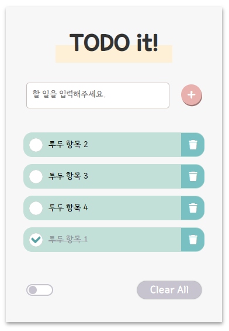

# 🚀 To Do List!

할 일 목록을 관리하는 어플리케이션 개발



## Getting Started

### Installing a development environment

```bash
# Install
npm install
```

### Run the project

```bash
# Install
npm install -g live-server

# Serve
live-server
```

Open browser to <http://localhost:8080/>

## License

MIT
