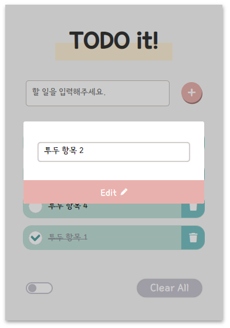

# 🚀 To Do List

할 일 목록을 관리하는 어플리케이션 개발




## Description

### User Functions

+ **항목 추가** : 입력창에 오늘의 할 일을 추가해보세요! 추가한 순서대로 투두리스트 목록에 등록됩니다.
+ **항목 체크** : 항목을 완료하면 체크해주세요. 완료된 항목는 하단으로 분리되어 남은 항목을 쉽게 파악할 수 있습니다.
+ **항목 삭제** : 하나씩 삭제하거나 다시 리셋하고 싶은 경우 Clear All 버튼을 이용해 전체 삭제를 할 수 있습니다.
+ **항목 변경** : 변경하고 싶은 항목 더블클릭하여 팝업창에서 수정해보세요. 팝업창은 배경을 클릭해 닫을 수 있습니다.
+ **항목 정렬** : 항목을 우선순위에 따라 정렬하고 싶다면 하단의 스위치를 켜 정렬 모드로 전환해주세요. 투두 항목을 드래그해 손쉽게 위치를 변경할 수 있습니다.

## Getting Started

### Installing a development environment

```bash
# Install
npm install
```

### Run the project

```bash
# Install
npm install -g live-server

# Serve
live-server
```

Open browser to <http://localhost:8080/>

## License

MIT
